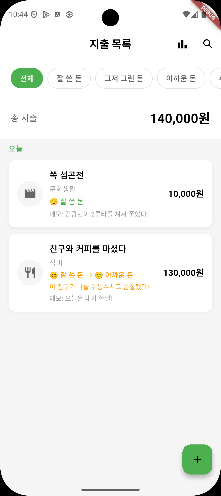
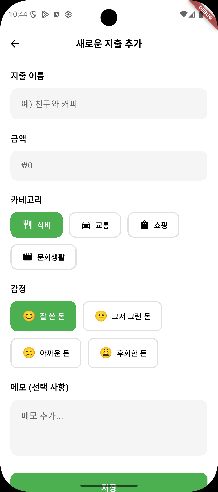
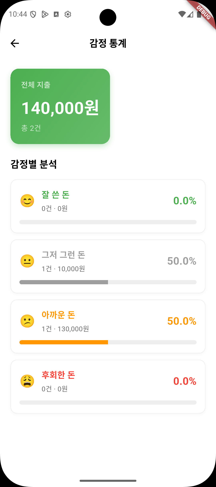
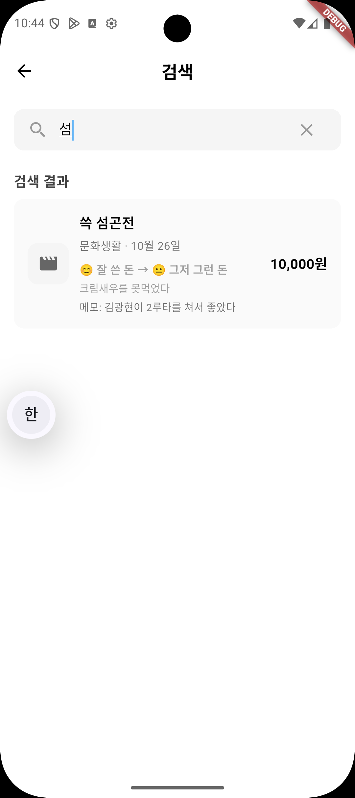

# 쓰는 가계부 💰

> "지출에 감정을 담다" - 단순한 기록을 넘어, 소비 습관을 돌아보는 감정 기반 가계부 앱

<p align="center">
  
  
  
  
</p>

## 📱 프로젝트 소개

**쓰는 가계부**는 단순히 지출을 기록하는 것을 넘어, 각 소비에 대한 감정을 함께 기록하여 자신의 소비 패턴을 돌아볼 수 있는 가계부 앱입니다.

### 주요 기능

- 💸 **지출 기록**: 금액, 카테고리, 메모와 함께 지출 내역 관리
- 😊 **감정 태그**: 각 지출에 대한 감정 상태 기록 (잘 쓴 돈, 그저 그런 돈, 아까운 돈, 후회한 돈)
- 🔄 **감정 변경 이력**: 지출에 대한 감정이 바뀌면 변경 사유와 함께 기록
- 📊 **통계 및 분석**: 카테고리별, 감정별 지출 현황 시각화
- 🔍 **검색 기능**: 지출 이름과 메모로 빠른 검색
- 🎨 **직관적인 UI**: 깔끔하고 사용하기 쉬운 인터페이스

## 📸 스크린샷

<div align="center">

### 지출 목록 화면
감정별 필터링과 총 지출 금액을 한눈에 확인할 수 있습니다. 감정 변경 이력도 함께 표시됩니다.



### 지출 추가 화면
카테고리와 감정을 선택하여 새로운 지출을 기록합니다.



### 통계 화면
감정별 지출 비율을 한눈에 확인할 수 있습니다.



### 검색 화면
지출 이름과 메모로 빠르게 검색할 수 있습니다.



</div>

## 🏗️ 아키텍처

### 프로젝트 구조

```
lib/
├── core/
│   ├── controllers/          # 전역 상태 관리
│   │   └── theme_controller.dart
│   └── themes/              # 테마 설정
│       └── app_theme.dart
│
├── features/
│   └── expense/             # 지출 관리 기능
│       ├── controllers/     # 비즈니스 로직
│       │   └── expense_controller.dart
│       │
│       ├── models/          # 데이터 모델
│       │   └── expense.dart
│       │
│       ├── screens/         # 화면
│       │   ├── expense_list_screen.dart
│       │   ├── add_expense_screen.dart
│       │   ├── search_screen.dart
│       │   ├── emotion_detail_screen.dart
│       │   └── statistics_screen.dart
│       │
│       ├── services/        # 데이터 레이어
│       │   └── expense_service.dart
│       │
│       └── widgets/         # 재사용 가능한 위젯 (13개)
│           ├── expense_form/      # 지출 입력 폼 관련
│           │   ├── category_selector_widget.dart
│           │   ├── status_selector_widget.dart
│           │   └── amount_input_field.dart
│           │
│           ├── search/            # 검색 화면 관련
│           │   ├── search_bar_widget.dart
│           │   ├── empty_search_state.dart
│           │   ├── no_results_state.dart
│           │   └── search_result_item.dart
│           │
│           ├── expense_list/      # 지출 목록 관련
│           │   ├── filter_chip_widget.dart
│           │   ├── expense_summary_card.dart
│           │   ├── empty_expense_state.dart
│           │   └── expense_card_widget.dart
│           │
│           └── emotion_detail/    # 감정별 상세 관련
│               ├── emotion_summary_card.dart
│               └── empty_emotion_state.dart
│
└── main.dart
```

### 기술 스택

- **상태 관리**: Riverpod
- **로컬 저장소**: Hive (NoSQL)
- **UI 프레임워크**: Flutter Material Design
- **다국어 지원**: Easy Localization
- **폰트**: Google Fonts
- **날짜 포맷**: intl

### 설계 원칙

#### 1. Feature-First 구조
기능별로 폴더를 나누어 관련 코드를 한 곳에 모아 관리합니다.

#### 2. Widget 분리 전략
- **Before**: 평균 450줄의 거대한 화면 파일들
- **After**: 화면당 평균 200줄 미만 + 재사용 가능한 위젯 13개
- **결과**: 전체 코드 57% 감소 (1,908줄 → 829줄)

#### 3. 단일 책임 원칙
각 위젯은 하나의 명확한 역할만 수행하도록 설계했습니다.

```dart
// ❌ Before: 628줄의 거대한 화면
class AddExpenseScreen extends StatefulWidget {
  // 모든 UI 로직이 한 파일에...
}

// ✅ After: 명확하게 분리된 위젯들
CategorySelectorWidget()  // 카테고리 선택만
StatusSelectorWidget()    // 감정 선택만
AmountInputField()        // 금액 입력만
```

## 🎨 UI/UX 디자인

### 디자인 도구

- **Stitch**: 기획/아이디어를 디자인으로 변환
- **HTML to Design Figma Plugin**: 웹 디자인을 Figma로 쉽게 변환
- 이 조합으로 기획 → 디자인 → 구현 시간을 대폭 단축했습니다!

### 디자인 특징

- 🎨 **직관적인 색상 시스템**: 감정별로 구분된 색상 (초록, 회색, 주황, 빨강)
- 📱 **모바일 최적화**: Android/iOS 모두 지원
- ♿ **접근성**: 명확한 아이콘과 텍스트 레이블

## 🚀 시작하기

### 요구사항

- Flutter 3.35.6 이상
- Dart 3.0 이상

### 설치 및 실행

```bash
# 1. 저장소 클론
git clone https://github.com/yourusername/expense-tracker.git
cd expense-tracker

# 2. 의존성 설치
flutter pub get

# 3. 앱 실행
flutter run

# 4. 테스트 실행
flutter test
```

### FVM 사용 (권장)

```bash
# FVM 설치
dart pub global activate fvm

# 프로젝트 Flutter 버전 설치
fvm install

# 의존성 설치
fvm flutter pub get

# 앱 실행
fvm flutter run
```

## 🧪 테스트

총 **75개의 테스트**가 모든 주요 기능을 검증합니다.

```bash
# 전체 테스트 실행
flutter test

# 특정 화면 테스트
flutter test test/screens/add_expense_screen_test.dart
flutter test test/screens/search_screen_test.dart
```

### 테스트 커버리지

- ✅ 지출 추가/수정 (27개 테스트)
- ✅ 검색 기능 (11개 테스트)
- ✅ 지출 목록 (20개 테스트)
- ✅ 통계 화면 (10개 테스트)
- ✅ 서비스 레이어 (7개 테스트)

## 📊 리팩토링 성과

| 화면 | Before | After | 감소율 | 위젯 수 |
|------|--------|-------|--------|---------|
| 지출 추가/수정 | 628줄 | 396줄 | **-37%** | 3개 |
| 검색 화면 | 384줄 | 145줄 | **-62%** | 4개 |
| 지출 목록 | 490줄 | 189줄 | **-61%** | 4개 |
| 감정별 상세 | 406줄 | 99줄 | **-76%** | 2개 |
| **총계** | **1,908줄** | **829줄** | **-57%** | **13개** |

## 🏆 치킨톤 (Chicken-Thon) 해커톤

### 프로젝트 배경

이 프로젝트는 **12시간 밤샘 해커톤**에서 탄생했습니다! 🌙

### 개발 과정

#### 🕐 0-3시간: 기획 및 디자인
- 아이디어 구체화: "감정을 기록하는 가계부"
- **Stitch**로 기획을 디자인으로 빠르게 변환
- **HTML to Design 플러그인**으로 Figma 디자인 시스템 구축

#### 🕒 3-8시간: 핵심 기능 개발
- Hive를 이용한 로컬 저장소 구축
- Riverpod 상태 관리 설정
- 지출 추가/목록 화면 구현
- 감정 태그 시스템 개발

#### 🕗 8-12시간: 추가 기능 및 마무리
- 검색 기능 구현
- 통계 화면 추가
- 감정 변경 이력 기능
- 테스트 작성 (75개)
- 버그 수정 및 최적화

### 핵심 도전 과제

1. **짧은 시간 내 완성도 높은 UI 구현**
   - 해결: Stitch로 기획을 디자인으로, HTML to Design 플러그인으로 Figma 변환 자동화
   
2. **복잡한 상태 관리**
   - 해결: Riverpod의 Provider 패턴으로 깔끔하게 정리

3. **감정 변경 이력 추적**
   - 해결: 이전 상태와 변경 사유를 모델에 포함하여 해결

### 배운 점

- ⚡ **빠른 프로토타이핑의 중요성**: 좋은 도구 선택이 개발 속도를 2배 이상 높임
- 🎯 **MVP 우선**: 핵심 기능부터 구현하고 점진적으로 개선
- 🧪 **테스트의 가치**: 밤샘 작업 중 테스트가 버그를 빠르게 잡아줌
- 🔄 **리팩토링**: 초기에는 빠르게, 나중에 깔끔하게 정리

### 성과

- ✅ 12시간 만에 완성도 높은 앱 완성
- ✅ 75개의 테스트로 안정성 확보
- ✅ 재사용 가능한 13개의 위젯 컴포넌트
- ✅ 57%의 코드 감소 (리팩토링 후)

## 🤝 기여하기

이 프로젝트는 오픈소스입니다! 기여를 환영합니다.

1. Fork the Project
2. Create your Feature Branch (`git checkout -b feature/AmazingFeature`)
3. Commit your Changes (`git commit -m 'Add some AmazingFeature'`)
4. Push to the Branch (`git push origin feature/AmazingFeature`)
5. Open a Pull Request

## 📝 라이선스

이 프로젝트는 MIT 라이선스 하에 배포됩니다.

## 👨‍💻 개발자

**hegunhee** - 12시간 밤샘 개발 🌙

- GitHub: [@hegunhee](https://github.com/hegunhee)

---

<p align="center">
  Made with ❤️ and ☕ during a 12-hour hackathon
</p>
